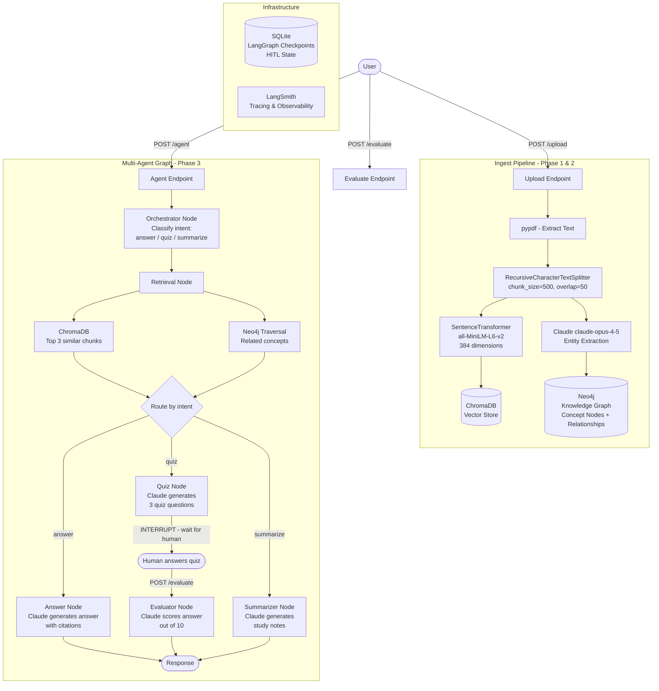
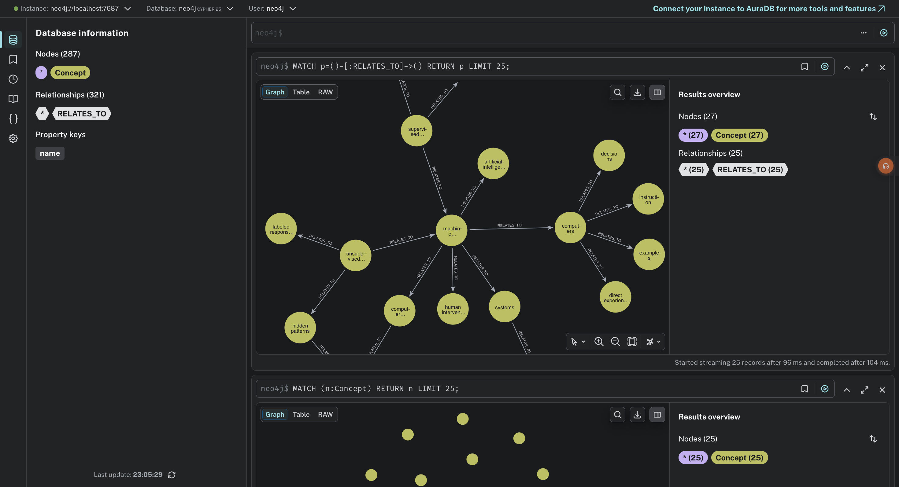
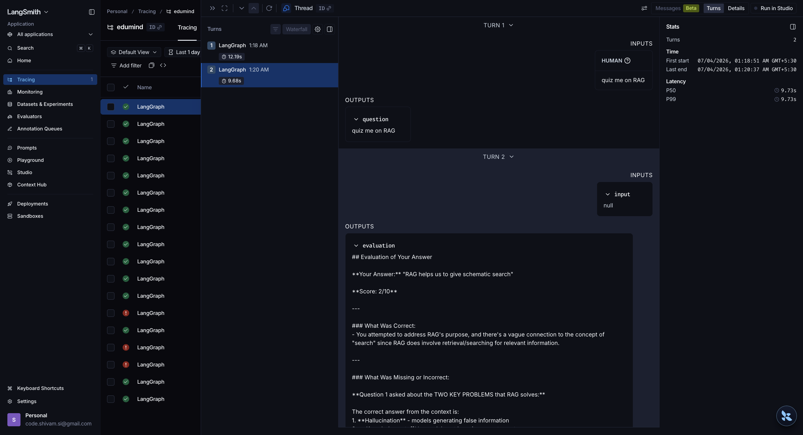
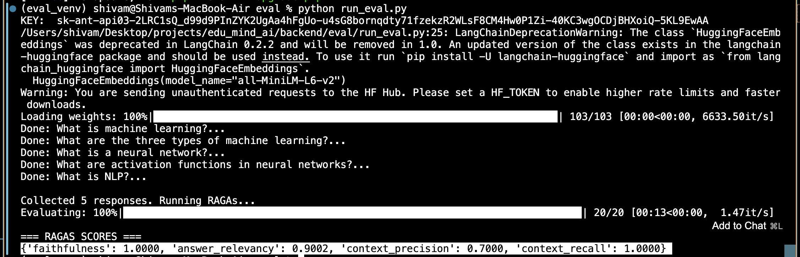
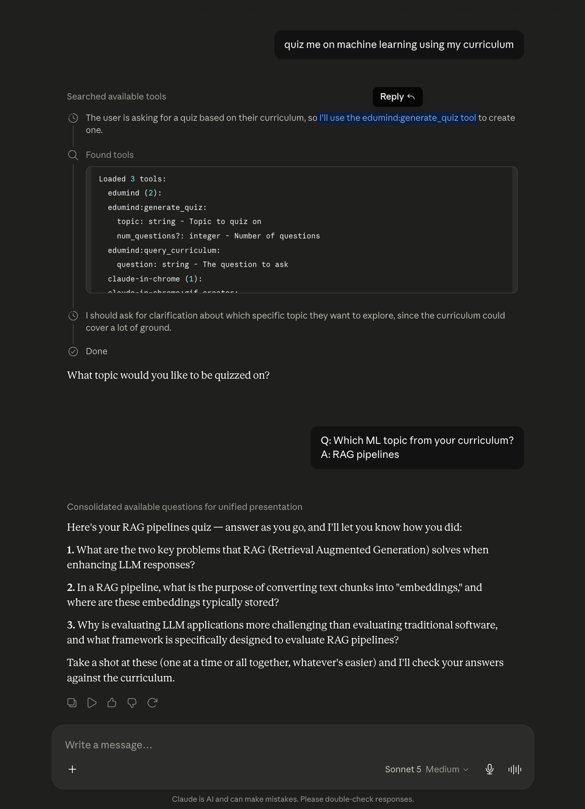

# Study Assistant AI — EduMind

An AI-powered study assistant built with RAG, Knowledge Graph, Multi-agent orchestration, and RAGAs evaluation. Upload a PDF curriculum and ask questions, generate quizzes, get evaluated, or get summaries — all grounded in your content.


---

## Architecture Overview



---

## Tech Stack

| Layer | Technology |
|-------|-----------|
| API | FastAPI + Uvicorn |
| PDF Parsing | pypdf |
| Chunking | LangChain RecursiveCharacterTextSplitter |
| Embeddings | sentence-transformers (all-MiniLM-L6-v2) |
| Vector DB | ChromaDB (local, SQLite-backed) |
| Knowledge Graph | Neo4j + Cypher |
| LLM | Anthropic Claude (claude-opus-4-5) |
| Agent Orchestration | LangGraph |
| HITL Checkpointing | SQLite via LangGraph |
| Tracing | LangSmith |
| RAG Evaluation | RAGAs |
| MCP Server | Anthropic MCP Python SDK |
| Containerization | Docker Compose |

---

## Project Structure

```
edu_mind_ai/
├── backend/
│   ├── api/
│   │   └── main.py              # FastAPI app + all endpoints
│   ├── core/
│   │   ├── config.py            # Shared clients (Chroma, Neo4j, Anthropic, embedder)
│   │   ├── model.py             # Pydantic models + EduMindState TypedDict
│   │   ├── ingest.py            # PDF parsing, chunking, embedding, Chroma storage
│   │   ├── query.py             # Vector search + graph traversal + Claude answer
│   │   └── graph.py             # Entity extraction + Neo4j operations
│   ├── agents/
│   │   └── agents.py            # LangGraph nodes + graph definition
│   ├── mcp/
│   │   └── server.py            # MCP server exposing 3 tools to Claude Desktop
│   ├── eval/
│   │   ├── run_eval.py          # RAGAs evaluation script
│   │   ├── golden_dataset.json  # 30 Q&A pairs for evaluation
│   │   └── requirements-eval.txt
│   ├── requirements.txt
│   └── Dockerfile
├── docs/
│   ├── neo4j.png                # Knowledge graph screenshot
│   ├── langsmith.png            # LangSmith tracing screenshot
│   ├── ragas.png                # RAGAs eval scores screenshot
│   └── mcp.png                  # Claude Desktop MCP tool call screenshot
├── docker-compose.yml
└── README.md
```

---

## Setup

### Prerequisites
- Docker Desktop
- Anthropic API key

### Run

```bash
# Clone the repo
git clone https://github.com/codeshivamsi-sketch/edu_mind_ai_study_assistance.git
cd edu_mind_ai_study_assistance

# Add environment variables
cp backend/.env.example backend/.env
# Fill in your API keys in backend/.env

# Start all services
docker-compose up --build
```

### Environment Variables

```env
ANTHROPIC_API_KEY=your-key
NEO4J_URI=bolt://neo4j:7687
NEO4J_USER=neo4j
NEO4J_PASSWORD=password
LANGCHAIN_API_KEY=your-key
LANGCHAIN_TRACING_V2=true
LANGCHAIN_PROJECT=edumind
```

---

## Running Evaluation

```bash
# Create eval environment (Python 3.11 required)
cd backend/eval
python3.11 -m venv eval_venv
source eval_venv/bin/activate
pip install -r requirements-eval.txt

# Make sure Docker is running first
docker-compose up -d

# Run RAGAs evaluation
python run_eval.py
```

---

## API Endpoints

### Upload PDF
```bash
POST /upload
Content-Type: multipart/form-data

curl -X POST http://localhost:8000/upload \
  -F "file=@curriculum.pdf"

# Response
{"filename": "curriculum.pdf", "chunks": 21}
```

### Query (Agent)
```bash
POST /agent
Content-Type: application/json

# Answer a question
{"question": "what is RAG?"}

# Generate quiz
{"question": "quiz me on neural networks"}

# Summarize
{"question": "summarize embeddings chapter"}

# Response includes thread_id for HITL
{"intent": "quiz", "quiz_questions": [...], "thread_id": "uuid"}
```

### Evaluate (HITL)
```bash
POST /evaluate
Content-Type: application/json

{
  "thread_id": "uuid-from-agent-response",
  "user_answer": "your answer here"
}

# Response
{"evaluation": "Score: 7/10 — Great answer on..."}
```

### Health Check
```bash
GET /health
# {"status": "ok"}
```

---

## Phase Breakdown

### Phase 1 — RAG Pipeline
- PDF upload + text extraction
- Chunking with overlap for context preservation
- Local embeddings (no OpenAI cost)
- ChromaDB vector storage
- Semantic search + Claude answer generation with citations

### Phase 2 — Knowledge Graph
- Claude extracts entities and relationships from each chunk
- Stored in Neo4j as typed concept nodes and edges
- Hybrid retrieval — vector search + graph traversal merged into context
- Enables questions like "what should I learn before neural networks?"



### Phase 3 — Agentic Workflow with LangGraph
- Orchestrator classifies intent and routes to the right agent
- Retrieval Agent queries both ChromaDB and Neo4j
- Quiz Agent generates questions from retrieved content
- Evaluator Agent scores user answers with detailed feedback
- Summarizer Agent condenses content into study notes
- Human-in-the-loop: graph pauses after quiz, resumes after user answers
- SQLite checkpointing persists state between API calls
- LangSmith tracing for full observability



### Phase 4 — RAG Evaluation with RAGAs
- 30-question golden dataset covering all curriculum chapters
- Offline evaluation pipeline hitting the live Docker API
- Isolated eval environment (Python 3.11) to avoid dependency conflicts
- Four RAGAs metrics scored using Claude as judge LLM and local embeddings:

| Metric | Score | What it measures |
|--------|-------|-----------------|
| Faithfulness | 1.00 | Answer grounded in retrieved context — no hallucination |
| Answer Relevancy | 0.90 | Answer directly addresses the question |
| Context Precision | 0.70 | Retrieved chunks were relevant to the question |
| Context Recall | 1.00 | All needed information was present in retrieved chunks |

**Key finding:** Context precision at 0.70 indicates fixed-size chunking (500 chars) retrieves some noise alongside relevant chunks. Faithfulness and recall at 1.0 confirm the system never hallucinates and never misses needed information.



### Phase 5 — MCP Server
- Exposed EduMind as an MCP server using the Anthropic MCP Python SDK
- Claude Desktop connects to the server and calls EduMind tools directly
- 3 tools registered:

| Tool | Description |
|------|-------------|
| `query_curriculum(question)` | RAG query over uploaded content — returns grounded answer with sources |
| `get_related_concepts(topic)` | Neo4j graph traversal — returns related concepts for a topic |
| `generate_quiz(topic, num_questions)` | Triggers Quiz Agent — returns quiz questions from curriculum |

- MCP server runs as a subprocess launched by Claude Desktop via stdio transport
- No extra HTTP server needed — communicates through stdin/stdout
- Claude Desktop automatically discovers and calls tools based on user intent

**Demo:** Open Claude Desktop → ask "quiz me on machine learning using my curriculum" → Claude calls `generate_quiz` → returns questions grounded in your uploaded PDF.

#### Connect to Claude Desktop

Add to `~/Library/Application Support/Claude/claude_desktop_config.json`:

```json
{
  "mcpServers": {
    "edumind": {
      "command": "/path/to/edu_mind_ai/backend/venv/bin/python",
      "args": ["/path/to/edu_mind_ai/backend/mcp/server.py"]
    }
  }
}
```

Restart Claude Desktop. Make sure Docker is running first.


